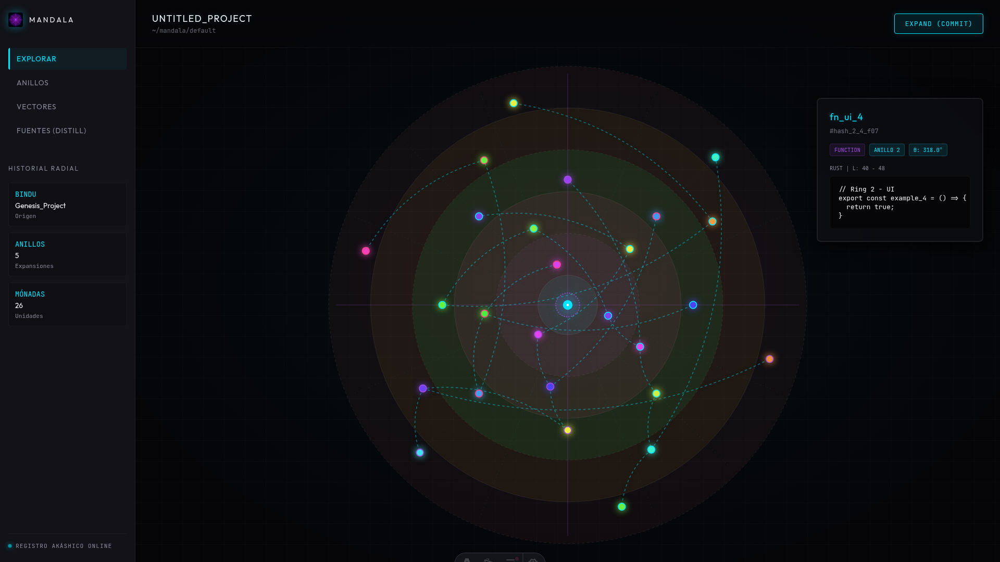
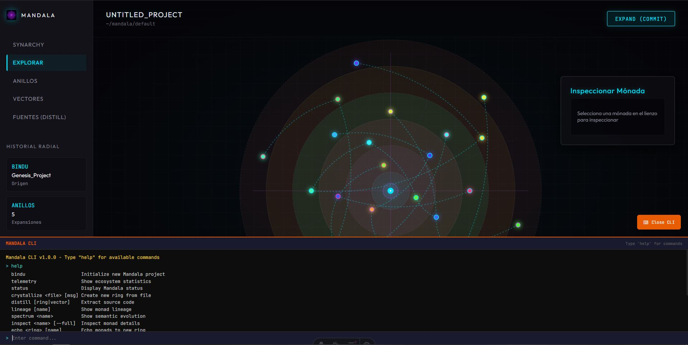
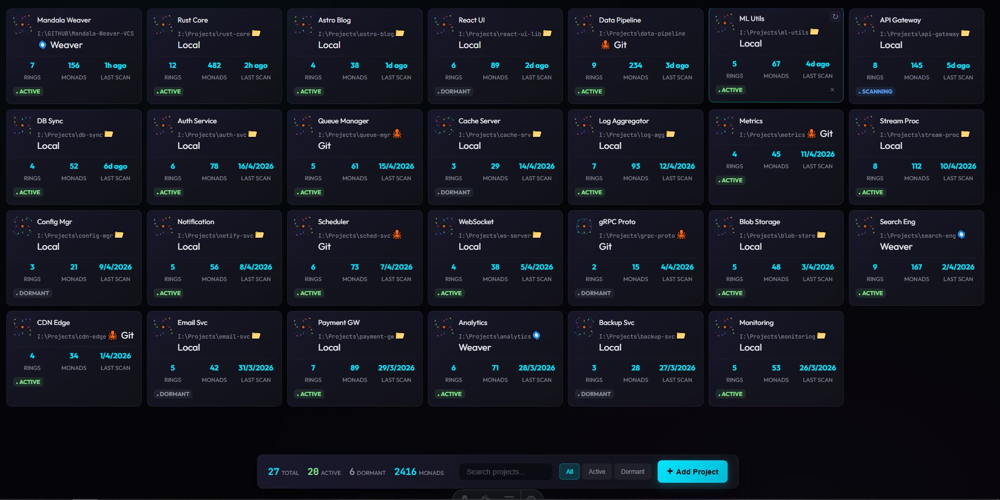

# Mandala Weaver Versions Cooperation System


The Circular Time of Software. A Synarchic, Spatial, and Semantic Code Orchestrator.

Mandala Weaver is the exact execution of the Golden Thread Engine instantiated in software architecture. It embraces a Radial Version Space where code is liberated from linear timelines. Software emanates as pure, distilled logic units from an immutable center (the Bindu) and expands through concentric rings of evolution.

This topology enables non-linear code orchestration: the Architect selects precise spatial coordinates across various rings and vectors, weaving them into a harmonious, executable reality. The result is the Distillation of a unique Source an infinite spiral of innovation where the code expands endlessly outward without ever executing the exact same entropy twice.




---

## Core Concepts
**The Golden Thread of Code**
- Monads (Pure Logic Units): Mandala Weaver isolates and versions atomic logic (functions, structs) using Abstract Syntax Tree analysis (ast-grep). It captures the absolute essence of the code by filtering out formatting and whitespace, ensuring semantic purity.
- Chromatic Synesthesia: Every Monad possesses a unique visual frequency. Its color is a direct projection of its blake3 semantic hash mapped to the HSL color space. The visual cortex instantly validates the truth of the logic: if the atomic logic mutates, the hue shifts; if the structure remains invariant, the color is immutable.
- Vectors and Rings (Spatial Topology): Software is organized as living geometry. Logical domains (e.g., UI, Network, Core Logic) are assigned specific Angles ($\theta$), while temporal iterations and evolutionary stages expand outward as Radii ($r$).
- Synarchic Weaving: Features and logical units coexist in perfect geometric space. Collaboration is a harmonious weaving of nodes drawn together by gravity and resonance. The architecture allows simultaneous evolution of components in complete synarchy, ensuring the network operates without interference.
- Distillation (Spatial Consolidation): The architectural process of compiling an executable version. The Architect selects exact coordinates across various rings and vectors, consolidating a unique Source by weaving independent functional capabilities into a unified structure.
- Manifests of Cooperation (YAML): Declarative templates that define assembly recipes. These manifests automate node selection, establish resonant compatibility, and inject semantic adapters to ensure absolute harmony between components operating in different rings.
- The Breathing of the Mandala (Semantic Zoom and Fractality): Navigation in radial space is an act of biological respiration alongside the system. The system breathes with the Architect in two directions:
  - Macro-Orchestration (Zoom Out): Expanding the perspective reveals the entire ecosystem. Individual nodes yield to the macro-structure, illuminating dependency galaxies, the density of evolutionary rings, and the global health of the synarchy at a single glance.
  - Micro-Immersion (Focused Zoom In): Selecting a Monad and pulling the perspective allows the Architect to traverse the node's membrane. The Monad undergoes a fractal unfolding—revealing its internal universe, its Abstract Syntax Tree (AST), its evolutionary lineage, and its atomic essence. It is a fluid transition from stellar orbit to quantum microsurgery.

---

## Synarchy



---

## Commands of Cooperation

### Genesis & State (The Foundation)

**`weave bindu`**: 
Instantiates the absolute Point Zero (0, 0). Creates the core geometric seed from which all future rings and vectors will emanate.

**`weave seed <source>`**: 
Plants the *Bindu* of an existing repository into your local hardware to begin a new fractal expansion in your own environment.

**`weave telemetry`**: 
Scans the current topology. Returns the pulse of your local ecosystem, showing which Monads are actively mutating and which are invariant, without generating "untracked file" noise.

---

### Cultivation & Expansion (Local Workflow)

**`weave focus <monad>`**: 
Selects active Monads from the latent space and brings them into the Architect's active constellation, preparing them for crystallization.

**`weave crystallize -m "<intent>"`**: 
Locks the AST and generates the `blake3` semantic hash. Expands the radius ($r + 1$) to immortalize the current logic in a new evolutionary Ring.

**`weave vector <angle>`**: 
Opens a new Angle ($\theta$) of exploration. You do not branch off into a separate, blind timeline; you simply begin weaving on a different spatial coordinate of the Mandala.

**`weave dormant`**: 
Puts active, uncrystallized Monads into the *Vórtice de Reposo* (latent space). Clears the current visual and processing cache without destroying the raw code.

---

### Spatial Navigation (Time & Geometry)

**`weave distill <coordinates>`**: 
The core spatial compilation command. Reads a YAML template or specific coordinates ($r, \theta$) to extract and weave the highest logic across different rings into a consolidated, executable Source.

**`weave spectrum <monad>`**: 
Analyzes the chromatic shift of a Monad between rings. Instead of showing red/green deleted text, it outputs the semantic variance based on its HSL signature, instantly confirming if the core logic or just the formatting mutated.

**`weave lineage`**: 
Queries the embedded Akashic Record (SurrealDB). Displays the evolutionary spiral of a specific Monad or Vector, tracking its reincarnations and geometric mutations from the Bindu to the present.

**`weave echo <ring_id>`**: 
In circular time, you do not erase the past. This command retrieves the exact semantic resonance of a Monad from an inner Ring and weaves it into the outermost, current Ring. 

---

### Synarchy & Propagation (The Network)

**`weave absorb`**: 
Integrates the latest crystallized nodes from the macro-ecosystem into your local environment, expanding your rings with the collective intelligence of the network.

**`weave synthesize <vector>`**: 
Finds the harmonic geometry between two evolving vectors. Because Monads exist in spatial coordinates, they do not collide; the engine weaves them together, resolving any logical dissonance through AST alignment.

**`weave emanate`**: 
Irradiates your local, crystallized updates outward to the macro-network, allowing other nodes in the Synarchy to observe and absorb your evolutionary rings.

---

## Technology Stack

The Loom is built on three high-performance engineering pillars:

- The Core (Engine): Rust + nalgebra (Orbital and Spatial Calculation) + ast-grep (Semantic Parsing).
- The Akashic Record: SurrealDB embedded (Graph database to trace the evolutionary lineage of code).
- The Canvas (UI): Tauri + Astro + React + D3.js (Massive interactive hardware-accelerated rendering). Features a dark neo-metric glassmorphism aesthetic with glowing monads, geometric polar grids, dynamic stat panels (Bindu, Rings, Monads), and an integrated real-time code inspector.

*Software is cultivated from the center outward.*

In this paradigm, software does not "advance" in a straight line from which branches branch, but **emanates** from a central seed (the *Bindu*) and expands in integration cycles. By tracing vectors through different rings, you create *Sources* (personalized executables) as if weaving constellations of pure logic.

---

## Architectural Philosophy

In traditional systems, a repository blindly advances forward. Branches separate and merge, creating a historical labyrinth that is difficult to navigate semantically.

Mandala Weaver proposes that perfect software possesses sacred geometry:

1. **The Bindu (The Center):** Every project originates from a central idea, a pure purpose. This is point (0, 0).
2. **The Vectors (Angles - θ):** Represent functionality domains. For example, the vector at 90° could be the user interface, and the vector at 180° the database engine.
3. **The Rings (Radii - r):** Represent temporal iterations, refactorizations, or abstraction levels. As you move away from the center, code becomes more complex, more integrated, or simply a more recent version in time.

---

## Logical Structure

### The Monad (The Functional Unit)

Instead of registering "entire files" that change, Mandala registers **Unit Logical Units** (a specific function, a data structure, a docstring). Each Monad is located at an exact coordinate on the circumference of a temporal ring.

### The Constellation (The Environment)

Monads in the same Ring that interact with each other form a Constellation. This represents a stable and harmonious state of the system at that degree of expansion.

### The Source (The Consolidated Executable)

Unlike a traditional checkout that loads the entire repository at a point in time, compiling a **Source** means tracing a line (or polygon) that selects Monads from different Rings and Vectors.

- *Example:* You can take the network engine from Ring 2 (because it was faster and simpler) and weave it with the User Interface from Ring 5 (which has the modern design), consolidating them into a single coherent Executable Unit.

---

## Guide for Creators of Circular Time Lines

For Architects and Weavers of this system, software creation changes from "adding lines of code" to "positioning logic in space."

**1. Planting the Bindu:**
Define the semantic structure of your project. Which angles will dominate your space? Divide 360 degrees into your main domains (UI, Core, I/O, Business Logic).

**2. Expansion (Radial Commit):**
When improving a functional unit, you do not overwrite the previous one. You create a new Ring that expands the radius of that unit. The previous history remains intact in the inner rings. The visual history of your software will look like the cross-section of a thousand-year-old tree.

**3. Spatial Weaving (Merging):**
Conflicts are not resolved by reading text lines, but by analyzing geometry. If two functional units occupy the same space in a new Ring, the Weaver must decide whether to merge them into a new node or shift one by a few degrees to coexist.

**4. Distillation (Inward Path):**
Navigation toward the center allows refactoring by eliminating unnecessary complexity. Traveling to Ring 1 or 2 of any vector will give you the purest and barest version of that functionality.

**5. Synarchy (Project Orchestration):**
Beyond a single Mandala, projects are organized into a Synarchy. A global registry tracks multiple repositories, allowing the Architect to navigate between different "universes" of code, maintaining cross-project awareness and structural coherence.

---

# Complete Technical Documentation

This section provides the complete technical architecture including all folder structures, files, functions, and their detailed descriptions.

---

## Project Structure Overview

```
Mandala-Weaver-VCS/
├── src-tauri/                              # Rust Backend (Tauri Desktop Application)
│   └── src/
│       ├── main.rs                        # Application entry point - initializes Tauri, maps DB state, mounts FS watcher
│       ├── lib.rs                         # Library root - module declarations
│       │   // Exposes: geometry, ontology, weaver, persistence, synarchy, language, interface
│       │
│       ├── geometry/                      # Topological engine - polar coordinate math
│       │   ├── mod.rs                     # Module exports (polar_space, transform, collision, etc.)
│       │   ├── polar_space.rs             # Polar coordinates (r, theta) calculation
│       │   ├── transform.rs               # Polar <-> Cartesian conversion (nalgebra)
│       │   └── collision.rs               # Overlap detection and orbital shifting
│       │
│       ├── ontology/                      # System entities - domain models
│       │   ├── mod.rs                     # Module exports (monad, bindu, constellation)
│       │   ├── monad.rs                   # Minimal functional unit (AST-based versioning)
│       │   └── bindu.rs                   # Immutable project center (Point Zero)
│       │
│       ├── weaver/                        # Business Logic - expansion/commit operations
│       │   ├── mod.rs                     # Expansion logic (radial commit)
│       │   ├── ast_extractor.rs           # Extraction of monads from source (ast-grep)
│       │   ├── threader.rs                # Lineage tracer (surrealdb graph queries)
│       │   ├── resolver.rs                # Delta resolution between rings
│       │   ├── source_compiler.rs         # Source assembler (distillation)
│       │   ├── auto_imports.rs            # Dependency analyzer for monads
│       │   └── file_writer.rs             # Disk persistence for distilled sources
│       │
│       ├── synarchy/                      # Project Orchestration
│       │   ├── mod.rs                     # Module exports
│       │   ├── registry.rs                # Project registry (JSON persistence)
│       │   └── sync.rs                    # Auto-scan and synchronization logic
│       │
│       ├── persistence/                   # SurrealDB database layer
│       │   ├── schemas.rs                 # SurrealQL definitions (tables, indexes)
│       │   └── surreal_bridge.rs          # Bridge with embedded SurrealDB
│       │
│       ├── interface/                     # IPC Bridge and CLI API
│       │   ├── projection_api.rs          # JSON projection API for Tauri (Mandala View)
│       │   ├── synarchy_api.rs            # IPC handlers for Project Explorer
│       │   └── cli_api.rs                 # Logic for the 'weave' CLI commands
│       │
│       └── Cargo.toml                     # Rust dependencies (tauri 2.0, surrealdb 3.0, ast-grep)
│
├── src/                          # Frontend (Astro + React + D3.js)
│   ├── pages/
│   │   ├── index.astro         # Main canvas (Workspace)
│   │   ├── explorer.astro      # Synarchy Explorer (Project list)
│   │   └── project/[id].astro  # Project detail view
│   │
│   ├── layouts/
│   │   └── AppLayout.astro     # Page wrapper with SidebarNav
│   │
│   ├── components/
│   │   ├── mandala/           # Interactive canvas components (D3/React)
│   │   │   ├── MandalaCanvas.tsx # SVG container & D3 mount
│   │   │   └── TooltipNode.tsx   # Floating monad details
│   │   │
│   │   ├── synarchy/          # Project management components
│   │   │   ├── ProjectList.tsx   # Grid of projects
│   │   │   ├── ProjectCard.tsx   # SVG mini-mandala preview
│   │   │   └── AddProject.tsx    # Dialog for new projects
│   │   │
│   │   ├── panels/            # Control interface
│   │   │   ├── SidebarNav.tsx    # View mode toggle (Orbit, Sínarc, etc.)
│   │   │   ├── MonadInspector.tsx# Source code & AST explorer
│   │   │   ├── DistillPanel.tsx  # Distillation tools
│   │   │   ├── RingsPanel.tsx    # Radial layers management
│   │   │   ├── VectorsPanel.tsx  # Domain lineage inspector
│   │   │   └── TerminalPanel.tsx # Integrated CLI feedback
│   │   │
│   │   └── ui/                # Shared atomic components (Button, Icon, etc.)
│   │
│   ├── lib/
│   │   ├── tauri/             # IPC Bridge
│   │   │   ├── commands.ts     # Workspace commands (export, expand)
│   │   │   ├── synarchy_api.ts # Synarchy commands (get_projects)
│   │   │   └── events.ts       # Backend listeners (FS watcher)
│   │   │
│   │   ├── d3/                # Visual Rendering engine
│   │   │   ├── renderer.ts     # Polar grid and nodes
│   │   │   ├── links.ts        # Evolutionary Bezier curves
│   │   │   └── interactions.ts # Zoom, pan, lasso selection
│   │   │
│   │   └── state/             # Global Store (Zustand)
│   │       └── workspaceStore.ts # Centralized reactive state
│   │
│   ├── types/                 # TS interfaces (Ontology & Synarchy)
│   ├── styles/                # Global variables and component styles
│   └── package.json           # Frontend dependencies (astro, d3, zustand)
│   │
│   ├── styles/
│   │   ├── global.css     # CSS variables and reset
│   │   │   // Variables: --bg-dark, --accent-primary, --text-main
│   │   │
│   │   ├── components/
│   │   │   ├── sidebar.css   # Side panel
│   │   │   └── workspace.css # Canvas area
│   │   │
│   │   └── panels/
│   │       └── panels.css  # Inspector and tooltips
│   │
│   └── package.json        # Node dependencies
│       // astro, react, d3, zustand, @tauri-apps/api
│
├── README_ES.md              # Spanish original documentation
├── Architecture.md         # Technical architecture and stack
├── Front-End.md            # Frontend architecture
├── Dependencies_Commands.md # Essential commands guide
└── package.json          # Project root dependencies (pnpm)
```

---

## Backend (Rust / Tauri) Detailed Structure

### File: `src-tauri/src/main.rs`

```rust
// Prevents additional console window on Windows in release, DO NOT REMOVE!!
#![cfg_attr(not(debug_assertions), windows_subsystem = "windows")]

mod interface;
mod persistence;
mod geometry;
mod ontology;
mod weaver;

use persistence::surreal_bridge::{connect_embedded, Db};
use interface::projection_api::{export_mandala_state, expand_ring};
use surrealdb::Surreal;
use tauri::Manager;

fn main() {
    tauri::Builder::default()
        .plugin(tauri_plugin_shell::init())
        .invoke_handler(tauri::generate_handler![
            export_mandala_state,
            expand_ring
        ])
        .run(tauri::generate_context!())
        .expect("error while running tauri application");
}
```

**Purpose:** Application entry point. Initializes Tauri, registers plugins, and connects the projection API commands.

---

### Module: `geometry/` - Topological Engine

#### File: `src-tauri/src/geometry/polar_space.rs`

```rust
/// Represents an exact coordinate in the Mandala.
pub struct PolarCoord {
    pub r: f64,      // Radius (distance from center)
    pub theta: f64,    // Angle (degrees from 0 to 360)
}

/// Creates a new coordinate normalizing the angle between 0 and 360 degrees.
pub fn new(r: f64, theta: f64) -> Self

/// Calculates the spatial "orbital" distance between two coordinates.
pub fn distance_to(&self, other: &PolarCoord) -> f64
```

**Purpose:** Handles polar coordinate calculations for positioning monads in the radial space.

---

#### File: `src-tauri/src/geometry/transform.rs`

```rust
/// Converts polar coordinates to cartesian (x, y) for UI rendering.
/// Uses nalgebra library for vector math.
pub fn to_cartesian(coord: &PolarCoord) -> Vector2<f64>

/// Converts cartesian (x, y) to polar (r, theta).
pub fn from_cartesian(x: f64, y: f64) -> PolarCoord
```

**Purpose:** Conversion between polar and cartesian coordinate systems for D3.js rendering.

---

#### File: `src-tauri/src/geometry/collision.rs`

```rust
/// Detects if two coordinates are too close (collision threshold).
pub fn detect_overlap(a: &PolarCoord, b: &PolarCoord, threshold: f64) -> bool

/// Shifts a coordinate slightly in its orbit to avoid overlap.
pub fn resolve_orbital_shift(coord: &mut PolarCoord, shift_degrees: f64)
```

**Purpose:** Prevents monads from occupying the same space in a ring.

---

#### File: `src-tauri/src/geometry/ring.rs`

```rust
/// Defines the boundary and metadata of a temporal expansion level.
pub struct Ring {
    pub level: u32,       // Ring number (1, 2, 3, ...)
    pub radius: f64,      // Radius value
    pub label: String     // Descriptive label
}

/// Calculates expansion radius based on previous radius and complexity delta.
pub fn calculate_expansion_radius(previous_radius: f64, complexity_delta: f64) -> f64
```

**Purpose:** Manages ring boundaries and expansion calculations.

---

#### File: `src-tauri/src/geometry/vector.rs`

```rust
/// Traces the logical domain line from the Bindu outward.
/// Returns the domain name (e.g., "UI", "CORE", "IO") for an angle.
pub fn snap_to_nearest_domain(angle: f64) -> String
```

**Purpose:** Maps angles to functional domains.

---

### Module: `ontology/` - System Entities

#### File: `src-tauri/src/ontology/semantic_hash.rs`

```rust
/// Generates a hash ignoring spaces and comments (AST-based).
/// Uses blake3 for fast cryptographic hashing.
pub fn generate_pure_hash(content: &str) -> String
```

**Purpose:** Creates content-addressable hashes of monads for change detection.

---

#### File: `src-tauri/src/ontology/bindu.rs`

```rust
/// Initializes the immutable project center (Commit 0).
pub struct Bindu {
    pub project_name: String,
    pub timestamp: u64
}

/// Creates a new Bindu (project genesis).
pub fn genesis(project_name: &str) -> Bindu
```

**Purpose:** Represents the immutable center point of the mandala.

---

#### File: `src-tauri/src/ontology/monad.rs`

```rust
/// The minimal functional unit (function, struct, docstring).
pub struct Monad {
    pub id: String,              // Unique identifier
    pub coord: PolarCoord,       // Position in radial space
    pub content: String,         // Source code content
    pub name: String,           // Display name
    pub ring: u32               // Ring level
}

/// Creates a new monad linked to a spatial coordinate.
pub fn spawn(id: String, name: String, coord: PolarCoord, content: String, ring: u32) -> Monad
```

**Purpose:** The fundamental unit of version control - a logical code unit, not a text line.

---

#### File: `src-tauri/src/ontology/constellation.rs`

```rust
/// Groups interconnected monads in the same ring.
pub struct Constellation {
    pub ring_level: u32,
    pub monads: Vec<Monad>
}

/// Validates the harmony of the constellation (no collisions).
pub fn validate_harmony(&self) -> Result<(), String>
```

**Purpose:** Groups monads in a ring as a stable state unit.

---

### Module: `weaver/` - Business Logic (The Loom)

#### File: `src-tauri/src/weaver/mod.rs`

```rust
/// Performs the 'Expand' operation: Reads a file, detects changes, creates a new radial ring.
/// 1. Read source file
/// 2. Determine current max ring
/// 3. Extract monads from code
/// 4. Get base ring monads for comparison
/// 5. Identify deltas
/// 6. Persist deltas with parent links
pub async fn expand_from_source(db: &Surreal<Db>, file_path: &str) -> anyhow::Result<u32>
```

**Purpose:** The main expansion (radial commit) function.

---

#### File: `src-tauri/src/weaver/ast_extractor.rs`

```rust
/// Extracts all functions/structures from a text file as raw Monads.
/// Uses ast-grep for semantic parsing.
pub fn extract_raw_monads(source_code: &str, ring: u32) -> Vec<Monad>
```

**Purpose:** Parses source code into semantic units (monads).

---

#### File: `src-tauri/src/weaver/threader.rs`

```rust
/// Traces the lineage of a monad toward the Bindu through SurrealDB relationships.
pub async fn trace_lineage(db: &Surreal<Db>, monad_id: &str) -> anyhow::Result<Vec<Monad>>
```

**Purpose:** Retrieves evolutionary history of a monad.

---

#### File: `src-tauri/src/weaver/resolver.rs`

```rust
/// Identifies which monads in a new set are deltas (changes) relative to a base set.
pub fn identify_deltas(base_set: &[Monad], new_set: &[Monad]) -> Vec<Monad>

/// Compares two monads to determine if they have evolved.
pub fn has_evolved(base: &Monad, target: &Monad) -> bool
```

**Purpose:** Detects changes between code versions.

---

#### File: `src-tauri/src/weaver/source_compiler.rs`

```rust
/// Assembles a collection of monads into a valid text file (The Source).
pub fn distill_source(monads: &[Monad]) -> String
```

**Purpose:** Creates compilable source code from selected monads.

---

### Module: `persistence/` - The Akashic Record

#### File: `src-tauri/src/persistence/schemas.rs`

```rust
/// Returns SurrealQL scripts to initialize radial tables.
pub fn get_initialization_queries() -> Vec<&'static str>
/// Example:
/// DEFINE TABLE monad SCHEMAFULL;
/// DEFINE TABLE evolves_to SCHEMAFULL;
/// DEFINE INDEX idx_monad_ring ON monad FIELDS ring;
```

**Purpose:** Database schema definitions.

---

#### File: `src-tauri/src/persistence/surreal_bridge.rs`

```rust
/// Connects to the in-memory database (fast development).
pub async fn connect_embedded() -> anyhow::Result<Surreal<Db>>

/// Persists a monad in space and creates the evolutionary edge from its previous version.
pub async fn insert_and_link(db: &Surreal<Db>, current: &Monad, parent_id: Option<&str>) -> anyhow::Result<()>

/// Retrieves all monads from a specific ring.
pub async fn get_ring(db: &Surreal<Db>, ring: u32) -> anyhow::Result<Vec<Monad>>

/// Retrieves monads within a specific angular sector.
pub async fn get_vector_sector(db: &Surreal<Db>, min_theta: f64, max_theta: f64) -> anyhow::Result<Vec<Monad>>

/// Retrieves absolutely all monads from the Mandala.
pub async fn get_all_monads(db: &Surreal<Db>) -> anyhow::Result<Vec<Monad>>
```

**Purpose:** Database operations for storing and retrieving monads.

---

### Module: `interface/` - Projection and CLI

#### File: `src-tauri/src/interface/projection_api.rs`

```rust
/// Exports spatial state as JSON for Tauri and D3.js to consume.
/// Returns: { bindu_name, constellations: [{ ring_level, monads }] }
#[tauri::command]
pub async fn export_mandala_state(db: State<'_, Surreal<Db>>) -> Result<String, String>

/// Expands a new ring from a source file.
#[tauri::command]
pub async fn expand_ring(db: State<'_, Surreal<Db>>, file_path: String) -> Result<u32, String>
```

**Purpose:** Tauri command handlers for frontend communication.

---

## Frontend (Astro + React + D3.js) Detailed Structure

### File: `src/pages/index.astro`

```astro
---
// Main canvas page (Workspace)
import AppLayout from '../layouts/AppLayout.astro';
import MandalaCanvas from '../components/mandala/MandalaCanvas';
import SidebarHistory from '../components/panels/SidebarHistory';
import MonadInspector from '../components/panels/MonadInspector';
---
<AppLayout title="Mandala Weaver">
  <main class="workspace">
    <SidebarHistory />
    <MandalaCanvas client:only="react" />
    <MonadInspector />
  </main>
</AppLayout>
```

**Purpose:** Main application page combining all UI components.

---

### File: `src/components/mandala/MandalaCanvas.tsx`

```tsx
// SVG/Canvas container component
// Mounts the D3 engine and manages SVG lifecycle
// Implements zoom, pan, and lasso selection

export default function MandalaCanvas() {
  // Uses D3.js for rendering thousands of nodes efficiently
  // Implements zoom behavior for "breathing" the mandala
  // Handles click/hover events for monad selection
}
```

**Purpose:** Main interactive canvas for the radial visualization.

---

### File: `src/lib/tauri/commands.ts`

```typescript
/// Requests from Rust the complete spatial state of the Mandala.
/// Returns: Promise<MandalaState>
export async function fetchMandalaState(): Promise<MandalaState>

/// Sends a command to expand (commit) a new ring.
export async function invokeExpand(filePath: string): Promise<void>
```

**Purpose:** IPC bridge for communication with Rust backend.

---

### File: `src/lib/d3/renderer.ts`

```typescript
/// Initializes the polar background grid (orbits and domains).
export function drawPolarGrid(svgSelection: d3.Selection, maxRadius: number)

/// Paints Monads at their exact coordinates.
export function renderMonads(svgSelection: d3.Selection, data: Monad[])
```

**Purpose:** D3.js rendering logic for the radial visualization.

---

### File: `src/lib/d3/interactions.ts`

```typescript
/// Configures zoom and panning behavior of the universe.
export function setupZoom(svgSelection: d3.Selection, config: InteractionConfig): d3.ZoomBehavior

/// Activates "lasso" mode for user to enclose Monads (Distill).
export function enableLassoSelection(svgSelection: d3.Selection, onSelect: (monads: Monad[]) => void)
```

**Purpose:** User interaction handling (zoom, pan, selection).

---

### File: `src/lib/state/workspaceStore.ts`

```typescript
// Zustand store for global state management
interface WorkspaceState {
  mandalaState: MandalaState | null;  // Current mandala data
  selectedMonad: Monad | null;         // Currently selected monad
  hoveredMonad: Monad | null;         // Currently hovered monad
  viewMode: 'orbit' | 'rings' | 'vectors' | 'distill';
  
  setMandalaState: (state: MandalaState) => void;
  selectMonad: (monad: Monad | null) => void;
  hoverMonad: (monad: Monad | null) => void;
  setViewMode: (mode: ViewMode) => void;
}

export const useWorkspaceStore = create<WorkspaceState>(...)
```

**Purpose:** Global state management without prop drilling.

---

### File: `src/types/geometry.ts`

```typescript
// Must match Rust PolarCoord struct
export interface PolarCoord {
  r: number;
  theta: number;
}
```

---

### File: `src/types/ontology.ts`

```typescript
// Must match Rust Monad struct
export interface Monad {
  id: string;
  name: string;
  coord: PolarCoord;
  content: string;
  ring: number;
}

export interface MandalaState {
  bindu_name: string;
  constellations: Constellation[];
}

export interface Constellation {
  ring_level: number;
  monads: Monad[];
}
```

**Purpose:** TypeScript type definitions matching Rust structs.

---

## Complete Data Flow Diagram

```
+-----------------------------------------------------------------------+
|                                    USER                                |
|    +-----------+    +-----------+    +-----------+    +----------------+   |
|    | Code      |    | Click on  |    | Hover over |    | Drag to       |   |
|    | Editor   |    | Monad    |    | Monad     |    | select       |   |
|    +-----+-----+    +-----+-----+    +-----+-----+    +------+------+   |
+--------+--------------------+--------------------+--------------------+--------+
           |                    |                    |                  |
           V                    V                    V                  V
+-----------------------------------------------------------------------+
|                           FRONTEND (Browser)                            |
|                                                                       |
|  +-----------------------------------------------------------------+  |
|  |                    index.astro (Main Page)                          |  |
|  |   +------------------------------------------------------------+  |  |
|  |   |     MandalaCanvas (React Island) client:only=react       |  |  |
|  |   |                                                           |  |  |
|  |   |   +-------------------------+    +-----------------------+ |  |  |
|  |   |   |   SVG Container         |    |   Panels (React)       | |  |  |
|  |   |   |                        |    |                       | |  |  |
|  |   |   | +-----------------+   |    | +-------------------+ | |  |  |
|  |   |   | | D3 Renderer    |   |    | | MonadInspector    | | |  |  |
|  |   |   | | -drawPolarGrid|   |    | | SidebarHistory    | | |  |  |
|  |   |   | | -renderMonads |   |    | | DistillPanel      | | |  |  |
|  |   |   | +-----------------+   |    | | Rings/VectorsPanel| | |  |  |
|  |   |   | +-----------------+   |    | | TerminalPanel     | | |  |  |
|  |   |   | | D3 Interactions|   |    | +---------+---------+ | |  |  |
|  |   |   | | -setupZoom    |   |    |           |           | |  |  |
|  |   |   | | -lassoSelect  |   |    | +---------+---------+ | |  |  |
|  |   |   | +-----------------+   |    | |  Zustand Store    | | |  |  |
|  |   |   +-----------------------+    | - mandalaState      | | |  |  |
|  |   |                                | - selectedMonad     | | |  |  |
|  |   |                                | - viewMode (Orbit+) | | |  |  |
|  |   |                                +---------------------+ | |  |  |
|  |   +--------------------------------------------------------+ |  |
|  |   |            explorer.astro (Synarchy Explorer)            |  |
|  |   |   +-----------------------+    +---------------------+   |  |
|  |   |   | ProjectList component |    | ProjectCard (SVG)   |   |  |
|  |   |   +-----------------------+    +---------------------+   |  |
|  |   +----------------------------------------------------------+  |
|  +-----------------------------------------------------------------+  |
|                              |                         |                    |
|                              V                         |                    |
|  +---------------------------------------------------+------------------+  |
|  |                    lib/tauri/commands.ts                          |  |
|  |   +--------------------------+    +----------------------------+ |  |
|  |   | export_mandala_state()   |    | distill_from_selection()   | |  |
|  |   | expand_ring()            |    | trace_monad_lineage()      | |  |
|  |   | get_projects()           |    | init_project()             | |  |
|  |   +------------+-------------+    +-------------+--------------+ |  |
|  +----------------+--------------------------------+-----------------+  |
+-------------------+--------------------------------+-----------+
                     | Tauri IPC (invoke)                  | Tauri IPC
                     V                                V
+-----------------------------------------------------------------------+
|                          BACKEND (Rust / Tauri)                         |
|                                                                       |
|   +--------------------------------------------------------------+  |
|  |                       main.rs (Entry Point)                   |  |
|  |   +----------------------------------------------------------+  |  |
|  |   |           interface/projection_api.rs                    |  |  |
|  |   |   +------------------------+    +-------------------+   |  |  |
|  |   |   | #[tauri::command]     |    | #[tauri::command] |   |  |  |
|  |   |   |export_mandala_state|    |  expand_ring    |   |  |  |
|  |   |   +---------+----------+    +------+--------+   |  |  |
|  |   +------------------------+---------------------------------+  |  |
|  |                        |                                  |  |
|  |   +--------------------+--------------------------------+------+  |
|  |   |                   weaver/mod.rs                     |  |  |
|  |   |   +----------------------------------------------+     |  |  |
|  |   |   | expand_from_source(db, file_path)           |  |  |
|  |   |   |  1. fs::read_to_string(file_path)         |  |  |
|  |   |   |  2. get_all_monads(db)                   |  |  |
|  |   |   |  3. extract_raw_monads(source_code)       |  |  |
|  |   |   |  4. get_ring(db, current_ring)         |  |  |
|  |   |   |  5. identify_deltas(base, new)         |  |  |
|  |   |   |  6. insert_and_link(db, monad, parent) |  |  |
|  |   |   +----------------------------------------------+     |  |  |
|  |   +----------------------------------------------+     |  |
|  +-------------------------------------------------------------+  |
|                                     |                              |
|   +----------------------------------+-----------------------------+  |
|   |                  weaver/ (Submodules)                |  |
|   |                                                       |  |
|   |   +-------------+    +-------------+    +------------------+ |  |
|   |   |ast_extractor|    |  resolver   |    | source_compiler  | |  |
|   |   |extract_raw()|    |identify_    |    | distill_source() | |  |
|   |   +-------------+    | deltas()    |    +------------------+ |  |
|   |   +-------------+    +-------------+    +------------------+ |  |
|   |   |auto_imports |    | file_writer |    |     threader     | |  |
|   |   |analyzer     |    | (Ring/Vec)  |    | (Lineage Trace)  | |  |
|   |   +-------------+    +-------------+    +------------------+ |  |
|   |   +--------------------------------+                     |  |
|   |   |         semantic_diff          |                     |  |
|   |   |         (AST Hash Diff)        |                     |  |
|   |   +--------------------------------+                     |  |
|   +-----------------------------------------------+-----+    |
|                                     |                   |
|   +----------------------------------+------------------+  |
|   |                  synarchy/ (Registry)               |  |
|   |                                                       |  |
|   |   +-------------+    +-------------+                     |  |
|   |   | registry.rs |    |   sync.rs   |                     |  |
|   |   | (JSON DB)   |    | (Auto-Scan) |                     |  |
|   |   +-------------+    +-------------+                     |  |
|   +-----------------------------------------------+-----+    |
|                                     |                   |
|   +----------------------------------+------------------+  |
|   |                  ontology/ (Entities)              |  |
|   |                                                       |  |
|   |   +-----------+  +-----------+  +-----------+  +---------+ |  |
|   |   | monad.rs  |  | semantic_ |  | bindu.rs  |  | constellation|  |
|   |   |           |  | hash.rs  |  |          |  | .rs         |  |
|   |   | struct   |  |          |  | struct   |  | struct      |  |
|   |   | Monad { |  |generate_ |  | Bindu { |  | Constellation|  |
|   |   |  id,    |  |pure_hash|  | project_ |  | ring_level, |  |
|   |   |  coord, |  |          |  | name,   |  | monads:Vec|  |
|   |   | content |  | blake3:: |  |timestamp|  | }          |  |
|   |   |  name,  |  | hash()  |  | }         |  |            |  |
|   |   |  ring   |  |          |  |genesis( |  | validate_  |  |
|   |   | }       |  |          |  |          |  | harmony()  |  |
|   |   | spawn() |  |          |  |          |  |            |  |
|   |   +-------+  +-----------+  +-----------+  +---------+ |  |
|   +-----------------------------------------------+--------+  |
|                                     |                   |
|   +----------------------------------+------------------+  |
|   |                  geometry/ (Mathematics)             |  |
|   |                                                       |  |
|   |   +------------+  +-----------+  +-----------+  +----------+|  |
|   |   |polar_space|  |transform.|  |collision.|  | vector.rs |  |
|   |   | .rs      |  | rs       |  | rs       |  |          |  |
|   |   |          |  |           |  |           |  |          |  |
|   |   |PolarCoord|  |to_cartesi|  | detect_  |  | snap_to_  |  |
|   |   | r,theta |  | an()     |  | overlap()|  | nearest_  |  |
|   |   | }        |  |from_cart|  | resolve_|  | domain() |  |
|   |   | new()   |  |()       |  | orbital_ |  |          |  |
|   |   |dist_to()|  | nalgebra |  | shift()  |  |          |  |
|   |   +--------+  +----------+  +----------+  +----------+  |
|   +-----------------------------------------------+--------+  |
|                                     |                   |
|   +----------------------------------+------------------+  |
|   |              persistence/ (SurrealDB)                    |  |
|   |                                                       |  |
|   |   +------------------------------+   +---------------------+ |  |
|   |   |      surreal_bridge.rs       |   |    schemas.rs        |  |  |
|   |   |                            |   |                   |  |  |
|   |   | connect_embedded()->Surreal<Db>|   |get_initialization  |  |  |
|   |   | insert_and_link()           |   | _queries()       |  |  |
|   |   | get_ring()                |   | ->Vec<&str>       |  |  |
|   |   | get_all_monads()          |   |                   |  |  |
|   |   | get_vector_sector()      |   | DEFINE TABLE monad |  |  |
|   |   |                        |   | DEFINE TABLE      |  |  |
|   |   |                        |   | evolves_to       |  |  |
|   |   |                        |   | DEFINE INDEX ring |  |  |
|   |   +----------------------+   +------------------+   |  |
|   |                        |                         |   |
|   |              +----------+------+                         |
|   |              | SurrealDB (Mem)  |                         |
|   |              | Namespace:mandala                    |
|   |              | Database:weaver |                         |
|   |              +-----------------+                         |
|   +-------------------------------------------------+  |
+-----------------------------------------------------------------------+
```

## Simplified Data Flow Diagrams

### Flow 1: Initial Mandala Load

```
User opens app
         │
         ▼
┌─────────────────────────┐
│ index.astro            │
│ MandalaCanvas (React)  │
└───────────┬─────────────┘
             │
             ▼
┌─────────────────────────┐
│ fetchMandalaState()     │
│ lib/tauri/commands.ts   │
└───────────┬─────────────┘
             │
             ▼ invoke('export_mandala_state')
┌─────────────────────────┐
│ projection_api.rs     │
│ export_mandala_state() │
└───────────┬─────────────┘
             │
             ▼
┌─────────────────────────┐
│ surreal_bridge.rs      │
│ get_all_monads()       │
└───────────┬─────────────┘
             │
             ▼ SELECT * FROM monad
┌────���─���──────────────────┐
│ SurrealDB (Mem)        │
│ -> Vec<Monad>          │
└───────────┬─────────────┘
             │
             ▼ JSON
┌─────────────────────────┐
│ Zustand Store          │
│ setMandalaState()      │
└───────────┬─────────────┘
             │
             ▼
┌─────────────────────────┐
│ D3 Renderer            │
│ renderMonads()         │
└─────────────────────────┘
```

### Flow 2: Monad Selection

```
User clicks on node
         │
         ▼
┌─────────────────────────┐
│ D3 Event Handler       │
│ onClick(monad)         │
└───────────┬─────────────┘
             │
             ▼
┌─────────────────────────┐
│ Zustand Store          │
│ selectMonad(monad)     │
└───────────┬─────────────┘
       +-----+-----+
       ▼           ▼
┌──────────┐ ┌──────────────┐
│ Sidebar  │ │ MonadInspect│
│ (update) │ │ or (update)  │
└──────────┘ └──────────────┘
```

### Flow 3: Expand (New Ring)

```
User presses "EXPAND"
         │
         ▼
┌─────────────────────────┐
│ invokeExpand(filePath)   │
│ lib/tauri/commands.ts  │
└───────────┬─────────────┘
             │
             ▼ invoke('expand_ring')
┌─────────────────────────┐
│ projection_api.rs      │
│ expand_ring(filePath)  │
└───────────┬─────────────┘
             │
             ▼
┌─────────────────────────┐
│ weaver/mod.rs          │
│ expand_from_source()   │
│ 1. Read file         │
│ 2. Extract monads   │
│ 3. Detect deltas    │
│ 4. Persist in DB    │
└───────────┬─────────────┘
             │
             ▼
┌─────────────────────────┐
│ surreal_bridge.rs      │
│ insert_and_link()     │
│ -> RELATE monad edges │
└───────────┬─────────────┘
             │
             ▼
┌─────────────────────────┐
│ Return new ring level │
│ -> Frontend updates  │
│ -> D3 draws new    │
└─────────────────────────┘
```

---

## Essential Commands

### Development (Hybrid Mode)

The most important command. Starts Vite (Astro) development server and compiles Rust backend, joining both in a native desktop window with Hot-Module-Replacement (HMR) active.

```bash
pnpm run tauri dev
```

*Note: The first time you run this, Cargo will take several minutes to download and compile `surrealdb` and `tauri`. Subsequent runs will be almost instant.*

---

### Testing the Core Engine (Backend Rust)

When developing geometric logic (`nalgebra`) or parsing (`ast-grep`), you don't need to bring up the graphical UI. It's better to test the engine in isolation.

```bash
# Navigate to backend directory
cd src-tauri

# Run all unit tests (geometry, local database)
cargo test

# Run tests for a specific module (e.g., geometric engine)
cargo test geometry

# Check if code compiles without generating binary (fast)
cargo check
```

---

### Frontend Testing and Pure Development

If you're designing the SVG canvas with D3.js and want to see it in the browser (Chrome/Firefox) instead of the native Tauri window:

```bash
# Start only Astro server
pnpm run dev
```

*Warning: In the pure browser, Tauri IPC calls will fail. Use it only for CSS layout or pure D3 animations.*

---

### Production Build (The Final Executable)

When the "Source" is ready to be distributed to other users. This command minifies JS, compiles Rust with maximum optimization (`opt-level = "s"`), and generates the installer (`.app` on Mac, `.exe` on Windows, `.AppImage` on Linux).

```bash
pnpm run tauri build
```

---

### Maintenance and Cleaning

If you have strange cache errors or change branches and the Rust compiler gets confused:

```bash
pnpm install

# Clean compiled Rust artifacts (frees a lot of disk space)
cd src-tauri
cargo clean
```

---

## Complete Dependencies Map (Rust)

```json
{
  "project": "Mandala-Weaver-VCS",
  "version": "0.1.0",
  "cargo_dependencies": {
    "tauri": "2.0.0",
    "tokio": "1.40",
    "tauri-plugin-shell": "2.0.0-rc.4",
    "nalgebra": "0.33",
    "ast-grep-core": "0.42.0",
    "ast-grep-language": "0.42.0",
    "surrealdb": "3.0.5",
    "blake3": "1.5",
    "serde": "1.0",
    "serde_json": "1.0",
    "anyhow": "1.0"
  },
  "internal_dependencies": {
    "main.rs": ["geometry/*", "ontology/*", "weaver/*", "persistence/*", "interface/*"],
    "geometry": {
      "polar_space.rs": [],
      "transform.rs": ["polar_space.rs"],
      "collision.rs": ["polar_space.rs"],
      "ring.rs": [],
      "vector.rs": []
    },
    "ontology": {
      "semantic_hash.rs": [],
      "bindu.rs": [],
      "monad.rs": ["geometry/polar_space.rs"],
      "constellation.rs": ["monad.rs"]
    },
    "weaver": {
      "ast_extractor.rs": ["ontology/monad.rs", "geometry/polar_space.rs", "ontology/semantic_hash.rs"],
      "threader.rs": ["ontology/monad.rs", "persistence/surreal_bridge.rs"],
      "resolver.rs": ["ontology/monad.rs"],
      "source_compiler.rs": ["ontology/monad.rs"],
      "mod.rs": ["weaver/ast_extractor.rs", "weaver/resolver.rs", "persistence/surreal_bridge.rs"]
    },
    "persistence": {
      "schemas.rs": [],
      "surreal_bridge.rs": ["schemas.rs", "ontology/monad.rs", "geometry/polar_space.rs"]
    },
    "interface": {
      "cli_commands.rs": [],
      "radial_tui.rs": [],
      "projection_api.rs": ["persistence/surreal_bridge.rs", "ontology/monad.rs", "weaver/mod.rs"]
    }
  }
}
```

---

## Complete Dependencies Map (Frontend)

```json
{
  "project": "Mandala-Weaver-UI",
  "version": "0.1.0",
  "npm_dependencies": {
    "@astrojs/react": "^3.1.0",
    "@tauri-apps/api": "^2.0.0",
    "@tauri-apps/plugin-shell": "^2.0.0",
    "astro": "^4.15.0",
    "d3": "^7.9.0",
    "react": "^18.3.1",
    "react-dom": "^18.3.1",
    "zustand": "^4.5.7"
  },
  "dev_dependencies": {
    "@tauri-apps/cli": "^2.0.0",
    "@types/d3": "^7.4.3",
    "@types/react": "^18.3.3",
    "@types/react-dom": "^18.3.0",
    "typescript": "^5.5.4",
    "vite": "^5.4.0"
  },
  "module_dependencies": {
    "pages": {
      "index.astro": ["layouts/AppLayout.astro", "components/mandala/MandalaCanvas.tsx", "components/panels/SidebarHistory.tsx"]
    },
    "components": {
      "mandala/MandalaCanvas.tsx": ["lib/d3/renderer.ts", "lib/d3/interactions.ts", "lib/state/workspaceStore.ts", "lib/tauri/commands.ts"],
      "mandala/TooltipNode.tsx": ["lib/state/workspaceStore.ts"],
      "panels/SidebarHistory.tsx": ["lib/state/workspaceStore.ts"],
      "panels/MonadInspector.tsx": ["lib/state/workspaceStore.ts"]
    },
    "lib/d3": {
      "renderer.ts": ["types/ontology.ts", "types/geometry.ts", "lib/d3/links.ts"],
      "links.ts": ["types/ontology.ts", "types/geometry.ts"],
      "interactions.ts": ["types/ontology.ts"]
    },
    "lib/tauri": {
      "commands.ts": ["types/ontology.ts", "types/geometry.ts"],
      "events.ts": []
    },
    "lib/state": {
      "workspaceStore.ts": ["types/ontology.ts", "lib/tauri/commands.ts"]
    }
  }
}
```

---

## Tauri Commands Available

| Command | Description | Return Type |
|---------|-------------|------------|
| `export_mandala_state` | Returns the completeMandala state as JSON | `Promise<string>` |
| `expand_ring` | Expands a new ring from a source file | `Promise<u32>` |

---

## Interface State (Zustand Store)

```typescript
interface WorkspaceState {
  mandalaState: MandalaState | null;
  selectedMonad: Monad | null;
  hoveredMonad: Monad | null;
  viewMode: 'orbit' | 'rings' | 'vectors' | 'distill';
  
  setMandalaState: (state: MandalaState) => void;
  selectMonad: (monad: Monad | null) => void;
  hoverMonad: (monad: Monad | null) => void;
  setViewMode: (mode: ViewMode) => void;
}
```

---

## Integration Philosophy (Astro + React + D3 + Zustand)

1. **Astro (The Shell):** `.astro` files (like `index.astro`) serve the initial HTML page. They are ultra-lightweight.
2. **React (The Interactive Island):** Components like `<MandalaCanvas client:only="react" />` hydrate on the client. React manages global state (which node the user clicked) but **DOES NOT** render the thousands of visual nodes, because React would collapse calculating the virtual DOM for a massive graph.
3. **D3.js (The Painter):** React hands the `<svg ref={canvasRef}>` container to D3.js. From there, `lib/d3/renderer.ts` takes total control of the DOM within that SVG, injecting nodes with hardware acceleration.
4. **Zustand (The State):** Manages the reactive state of the application. The store centralizes `mandalaState`, `selectedMonad`, `hoveredMonad`, and `viewMode`. Any component can subscribe to these changes without prop drilling.

---

## Implementation Roadmap

For the full 10-phase development roadmap — from the completed foundations through Distillation Templates, CLI/TUI, Multi-Language AST, Performance Optimization, and Collaborative Mandala Networks — see **[Roadmap.md](./Roadmap.md)**.

**Current progress:** 22 items complete, 9 needing refinement, 69 pending across 98 total work items.

| Phase | Focus | Status |
|-------|-------|--------|
| 0 — Foundation | Scaffolding & Config | ✅ Complete |
| 1 — Core Engine | Geometry & Parsing | 🔧 4/7 done — AST integration pending |
| 2 — Akashic Record | SurrealDB Persistence | 🔧 4/7 done — Search & lineage queries pending |
| 3 — The Weaver | Version Control Logic | 🚧 1/14 done — Incoherence detection, semantic diff pending |
| 4 — The Loom | Tauri IPC Bridge | 🚧 3/12 done — FS watcher, distill/lineage commands pending |
| 5 — The Mandala | D3.js Visualization | 🚧 6/20 done — Lineage rendering, breathing animation pending |
| 6 — Distillation Templates | YAML Manifests | ⬜ Not started |
| 7 — CLI & TUI | Command-Line Interface | ⬜ Not started |
| 8 — Multi-Language | Polyglot AST Support | ⬜ Not started |
| 9 — Performance | Storage & Rendering | ⬜ Not started |
| 10 — Collaboration | Sharing & Distribution | ⬜ Not started |

---

*Software is cultivated from the center outward.*
