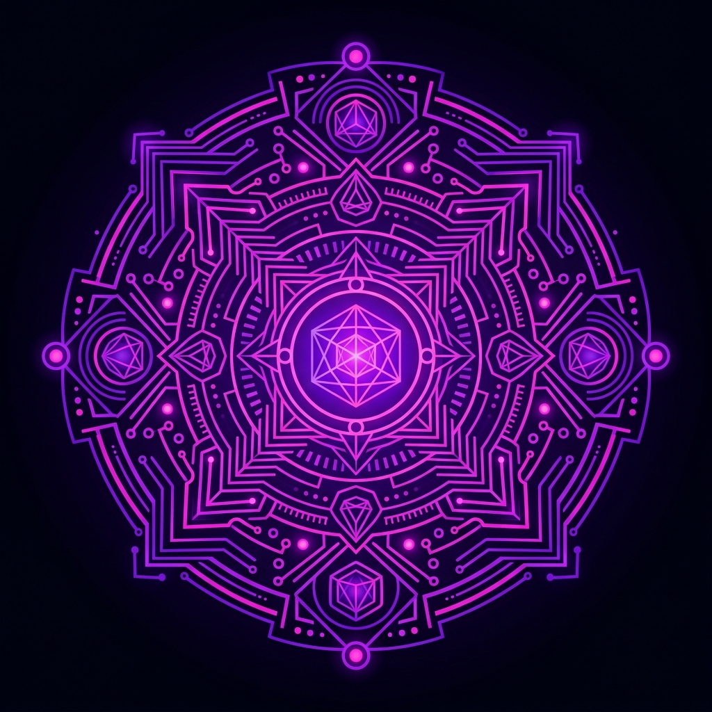
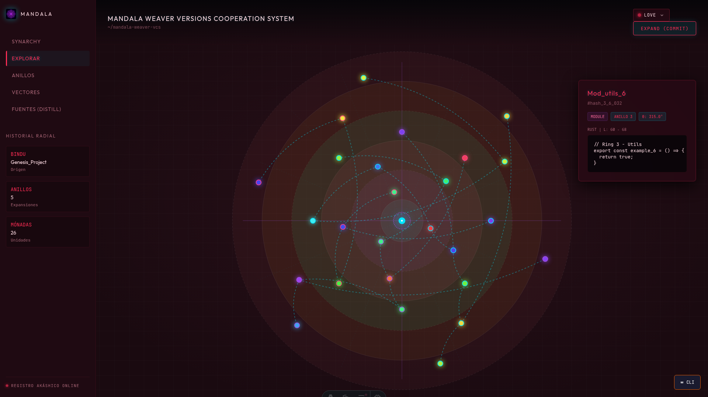
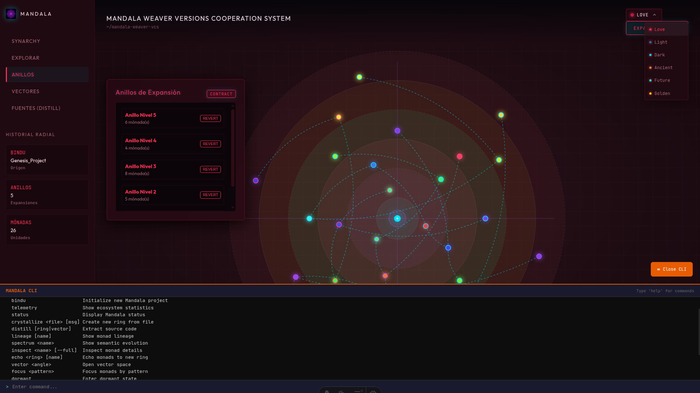
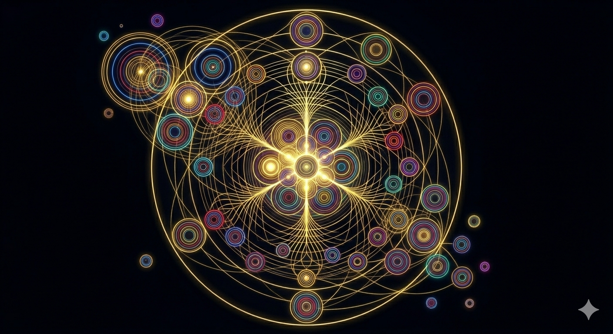
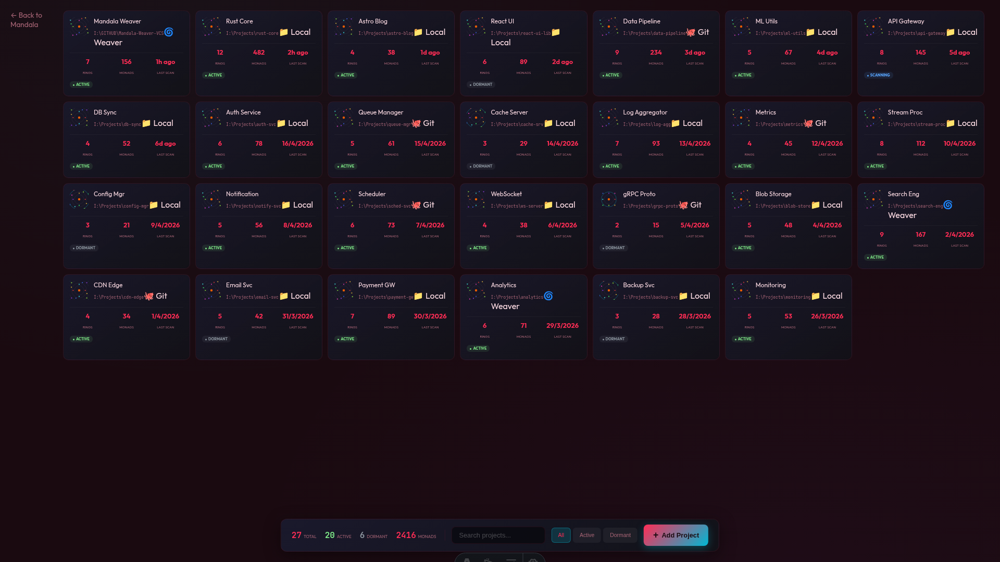

# Mandala Weaver Versions Cooperation System



The Spiral Time of Software. A Synarchic, Spatial, and Semantic Code Orchestrator.

Mandala Weaver is the exact execution of the Golden Thread Engine instantiated in software architecture. It embraces a Radial Version Space where code is liberated from linear timelines. Software emanates as pure, distilled logic units from an immutable center (the Bindu) and expands through concentric rings of evolution.

This topology enables non-linear code orchestration: the Architect selects precise spatial coordinates across various rings and vectors, weaving them into a harmonious, executable reality. The result is the Distillation of a unique Source an infinite spiral of innovation where the code expands endlessly outward without ever executing the exact same entropy twice.




---

## Core Concepts
**The Golden Thread of Code**
- Monads (Pure Logic Units): Mandala Weaver isolates and versions atomic logic (functions, structs) using Abstract Syntax Tree analysis (ast-grep). It captures the absolute essence of the code by filtering out formatting and whitespace, ensuring semantic purity.
- Code QR Polar Chromatic Synesthesia: Every Monad possesses a unique visual frequency, rendered not as a static node, but as a procedural radial data matrix. Its geometry and color are a direct projection of its blake3 semantic hash mapped to the HSL color space. This allows the Architect to read the macro-ecosystem of the Mandala intuitively, instantly understanding the weight and function of the code without needing to click or parse raw text. The visual cortex instantly validates the truth of the logic: if the atomic logic mutates, the geometry and hue shift; if the structure remains invariant, the polar signature is immutable.
  - Feeling the concept:

- Vectors and Rings (Spatial Topology): Software is organized as living geometry. Logical domains (e.g., UI, Network, Core Logic) are assigned specific Angles ($\theta$), while temporal iterations and evolutionary stages expand outward as Radii ($r$).
- Synarchic Weaving: Features and logical units coexist in perfect geometric space. Collaboration is a harmonious weaving of nodes drawn together by gravity and resonance. The architecture allows simultaneous evolution of components in complete synarchy, ensuring the network operates without interference.
- Distillation (Spatial Consolidation): The architectural process of compiling an executable version. The Architect selects exact coordinates across various rings and vectors, consolidating a unique Source by weaving independent functional capabilities into a unified structure.
- Manifests of Cooperation (YAML): Declarative templates that define assembly recipes. These manifests automate node selection, establish resonant compatibility, and inject semantic adapters to ensure absolute harmony between components operating in different rings.
- The Breathing of the Mandala (Semantic Zoom and Fractality): Navigation in radial space is an act of biological respiration alongside the system. The system breathes with the Architect in two directions:
  - Macro-Orchestration (Zoom Out): Expanding the perspective reveals the entire ecosystem. Individual nodes yield to the macro-structure, illuminating dependency galaxies, the density of evolutionary rings, and the global health of the synarchy at a single glance.
  - Micro-Immersion (Focused Zoom In): Selecting a Monad and pulling the perspective allows the Architect to traverse the node's membrane. The Monad undergoes a fractal unfolding—revealing its internal universe, its Abstract Syntax Tree (AST), its evolutionary lineage, and its atomic essence. It is a fluid transition from stellar orbit to quantum microsurgery.

---

## Synarchy



---
## Essential Commands

*Note: The first time you run this, Cargo will take several minutes to download and compile `surrealdb` and `tauri`. Subsequent runs will be almost instant.*
### Play

```bash
pnpm run dev
pnpm run tauri-dev
```

### Testing the Core Engine (Backend Rust)

```bash
# Navigate to backend directory
cd src-tauri

# Check if code compiles without generating binary (fast)
cargo check
```

---

## CLI Cooperation Line Interface

### Genesis & State (The Foundation)

**`weave bindu`**: 
Instantiates the absolute Point Zero (0, 0). Creates the core geometric seed from which all future rings and vectors will emanate.

**`weave seed <source>`**: 
Plants the *Bindu* of an existing repository into your local hardware to begin a new fractal expansion in your own environment.

**`weave telemetry`**: 
Scans the current topology. Returns the pulse of your local ecosystem, showing which Monads are actively mutating and which are invariant, without generating "untracked file" noise.

---

### Cultivation & Expansion (Local Workflow)

**`weave focus <monad>`**: 
Selects active Monads from the latent space and brings them into the Architect's active constellation, preparing them for crystallization.

**`weave crystallize -m "<intent>"`**: 
Locks the AST and generates the `blake3` semantic hash. Expands the radius ($r + 1$) to immortalize the current logic in a new evolutionary Ring.

**`weave vector <angle>`**: 
Opens a new Angle ($\theta$) of exploration. You do not branch off into a separate, blind timeline; you simply begin weaving on a different spatial coordinate of the Mandala.

**`weave dormant`**: 
Puts active, uncrystallized Monads into the *Vórtice de Reposo* (latent space). Clears the current visual and processing cache without destroying the raw code.

---

### Spatial Navigation (Time & Geometry)

**`weave distill <coordinates>`**: 
The core spatial compilation cooperation. Reads a YAML template or specific coordinates ($r, \theta$) to extract and weave the highest logic across different rings into a consolidated, executable Source.

**`weave spectrum <monad>`**: 
Analyzes the chromatic shift of a Monad between rings. Instead of showing red/green deleted text, it outputs the semantic variance based on its HSL signature, instantly confirming if the core logic or just the formatting mutated.

**`weave lineage`**: 
Queries the embedded Akashic Record (SurrealDB). Displays the evolutionary spiral of a specific Monad or Vector, tracking its reincarnations and geometric mutations from the Bindu to the present.

**`weave echo <ring_id>`**: 
In spiral time, This cli retrieves the exact semantic resonance of a Monad from a Ring and weaves it into the an outer, inner, present Ring. 

---

### Synarchy & Propagation (The Network)

**`weave absorb`**: 
Integrates the latest crystallized nodes from the macro-ecosystem into your local environment, expanding your rings with the collective intelligence of the network.

**`weave synthesize <vector>`**: 
Finds the harmonic geometry between two evolving vectors. Because Monads exist in spatial coordinates, they do not collide; the engine weaves them together, resolving any logical dissonance through AST alignment.

**`weave emanate`**: 
Irradiates your local, crystallized updates outward, inward to the macro-network, allowing other nodes in the Synarchy to observe and absorb your evolutionary rings.

---

## Technology Stack

The Loom is built on three high-performance engineering pillars:

- The Core (Engine): Rust + nalgebra (Orbital and Spatial Calculation) + ast-grep (Semantic Parsing).
- The Akashic Record: SurrealDB embedded (Graph database to trace the evolutionary lineage of code).
- The Canvas (UI): Tauri + Astro + React + D3.js (Massive interactive hardware-accelerated rendering). Features a dark neo-metric glassmorphism aesthetic with glowing monads, geometric polar grids, dynamic stat panels (Bindu, Rings, Monads), and an integrated real-time code inspector.

*Software is cultivated from the center outward.*

In this paradigm, software does not "advance" in a straight line from which branches branch, but **emanates** from a central seed (the *Bindu*) and expands in integration cycles. By tracing vectors through different rings, you create *Sources* (personalized executables) as if weaving constellations of pure logic.

---

## Architectural Philosophy

In traditional systems, a repository blindly advances forward. Branches separate and merge, creating a historical labyrinth that is difficult to navigate semantically.

Mandala Weaver proposes that perfect software possesses sacred geometry:

1. **The Bindu (The Center):** Every project originates from a central idea, a pure purpose. This is point (0, 0).
2. **The Vectors (Angles - θ):** Represent functionality domains. For example, the vector at 90° could be the user interface, and the vector at 180° the database engine.
3. **The Rings (Radii - r):** Represent temporal iterations, refactorizations, or abstraction levels. As you move away from the center, code becomes more complex, more integrated, or simply a more recent version in time.

---

## Logical Structure

### The Monad (The Functional Unit)

Instead of registering "entire files" that change, Mandala registers **Unit Logical Units** (a specific function, a data structure, a docstring). Each Monad is located at an exact coordinate on the circumference of a temporal ring.

### The Constellation (The Environment)

Monads in the same Ring that interact with each other form a Constellation. This represents a stable and harmonious state of the system at that degree of expansion.

### The Source (The Consolidated Executable)

Unlike a traditional checkout that loads the entire repository at a point in time, compiling a **Source** means tracing a line (or polygon) that selects Monads from different Rings and Vectors.

- *Example:* You can take the network engine from Ring 2 (because it was faster and simpler) and weave it with the User Interface from Ring 5 (which has the modern design), consolidating them into a single coherent Executable Unit.

---

## Guide for Creators of Spiral Time Lines

For Architects and Weavers of this system, software creation changes from "adding lines of code" to "resonance logic in space."

**0. Omnidirectional (Evolution):**
The Synarchic knowledge flows in all directions inner, outer, present.

**1. Planting the Bindu:**
Define the semantic structure of your project. Which angles will dominate your space? Divide 360 degrees into your main domains (UI, Core, I/O, Business Logic).

**2. Expansion (Radial Commit):**
When improving a functional unit, you do not overwrite the previous one. You create a new Ring that expands the radius of that unit. The previous history remains intact in the inner rings. The visual history of your software will look like the cross-section of a thousand-year-old tree.

**3. Spatial Weaving (Merging):**
Conflicts are not resolved by reading text lines, but by analyzing geometry. If two functional units occupy the same space in a new Ring, the Weaver must decide whether to merge them into a new node or shift one by a few degrees to coexist.

**4. Distillation (Inward Path):**
Navigation toward the center allows refactoring by eliminating unnecessary complexity. Traveling to Ring 1 or 2 of any vector will give you the purest and barest version of that functionality.

**5. Synarchy (Project Orchestration):**
Beyond a single Mandala, projects are organized into a Synarchy. A global registry tracks multiple repositories, allowing the Architect to navigate between different "universes" of code, maintaining cross-project awareness and structural coherence.

---

# Complete Technical Documentation

## Complete Data Flow Diagram

```
+-------------------------------------------------------------------------------------+
|                                        USER                                           |
|   +-----------+   +-----------+   +-----------+   +-----------+   +----------------+   |
|   | Code      |   | Click on  |   | Hover over|   | Drag to   |   | Terminal/CLI  |   |
|   | Editor    |   | Monad    |   | Monad     |   | select    |   | weave cooperation|   |
|   +-----+-----+   +-----+-----+   +-----+-----+   +------+----+   +-------+--------+   |
+--------+----------------+----------------+----------------+----------------+----------------+
              |                |                |                |                |
              V                V                V                V                V
+-------------------------------------------------------------------------------------+
|                                FRONTEND (Browser)                                     |
|                                                                                       |
|   +-------------------------------------------------------------------------------+   |
|   |                    index.astro (Main Workspace)                               |   |
|   |   +-------------------------------------------------------------------------+ |   |
|   |   |     MandalaCanvas (React Island) client:only=react                    | |   |
|   |   |                                                                         | |   |
|   |   |   +-----------------------------+   +----------------------------------+ | |   |
|   |   |   |   SVG Container              |   |   Panels (React)                | | |   |
|   |   |   |                              |   |                                  | | |   |
|   |   |   | +-------------------------+ |   | +------------------------------+ | | |   |
|   |   |   | | D3 Renderer           | |   | | MonadInspector               | | | |   |
|   |   |   | | - renderer.ts         | |   | | SidebarHistory               | | | |   |
|   |   |   | | - zoom.ts             | |   | | DistillPanel                 | | | |   |
|   |   |   | | - interactions.ts     | |   | | RingsPanel                   | | | |   |
|   |   |   | | - animations.ts       | |   | | VectorsPanel                 | | | |   |
|   |   |   | +-------------------------+ |   | | TerminalPanel                | | | |   |
|   |   |   | +-------------------------+ |   | | ThemeSelector                | | | |   |
|   |   |   | | SidebarNav (ViewMode)  | |   | +------------------------------+ | | |   |
|   |   |   | +-------------------------+ |   |              |                   | | |   |
|   |   |   +-----------------------------+   | +------------+-------------+     | | |   |
|   |   |                                    | | Zustand Store             | | | |   |
|   |   |                                    | | - mandalaState             | | | |   |
|   |   |                                    | | - selectedMonad            | | | |   |
|   |   |                                    | | - viewMode (Orbit+)        | | | |   |
|   |   |                                    | +----------------------------+ | | |   |
|   |   +------------------------------------+----------------------------------+ |   |
|   |   |            explorer.astro (Synarchy Explorer)                     |   |
|   |   |   +----------------------------+    +-----------------------------+     |   |
|   |   |   | ProjectList component     |    | ProjectCard (SVG mini-mandala)|    |   |
|   |   |   | AddProjectDialog           |    |                             |    |   |
|   |   |   +----------------------------+    +-----------------------------+     |   |
|   |   +-------------------------------------------------------------------------+   |
|   +-------------------------------------------------------------------------------+   |
|                                      |                           |                     |
|                                      V                           |                     |
|   +---------------------------------------------------+----------+----------------+   |
|   |              lib/tauri/cooperation.ts                 |    lib/tauri/synarchy_api.ts  |   |
|   |   +--------------------------+                    |    +-------------------------+ |   |
|   |   | export_mandala_state()  |                    |    | get_projects()         | |   |
|   |   | expand_ring()           |                    |    | init_project()         | |   |
|   |   | trace_monad_lineage()   |                    |    +-------------------------+ |   |
|   |   +-------------------------+                    +-----------------------------+   |
|   +--------------------------------+--------------------------------+----------------+   |
|                                    | Tauri IPC (invoke)                                    |
+------------------------------------+----------------------------------------------------+
                                     |
                                     V
+-------------------------------------------------------------------------------------+
|                                BACKEND (Rust / Tauri)                                 |
|                                                                                       |
|   +------------------------------------------------------------------------------------
|   |                                 main.rs (Entry Point)                               |
|   |   +----------------------------------------------------------------------------------------
|   |   |                  interface/ (IPC Bridge & CLI API)                              |
|   |   |   +------------------+------------------+------------------+-------------------+      |
|   |   |   | cli_cooperation.rs  | projection_api.rs | synarchy_api.rs  | collaboration_api |      |
|   |   |   | (weave CLI)      | (Mandala View)   | (Project Explorer| .rs (Multiplayer) |      |
|   |   |   +------------------+------------------+------------------+-------------------+      |
|   |   |   +------------------+------------------+------------------+-------------------+      |
|   |   |   | cli_api.rs       | radial_tui.rs    | template_api.rs  |                   |      |
|   |   |   | (IPC handlers)   | (TUI Renderer)   | (YAML Templates) |                   |      |
|   |   |   +------------------+------------------+------------------+-------------------+      |
|   |   +----------------------------------------------------------------------------------------
|   |                                     |                                                   |
|   |   +----------------------------------+--------------------------------------------------+   |
|   |   |                                   |                                                  |   |
|   |   |   +-------------------------------+---------------------------------------------------+  |
|   |   |   |                        weaver/ (Business Logic)                                  |  |
|   |   |   |                                                                                   |  |
|   |   |   |   +-------------+    +-------------+    +------------------+    +-----------+   |  |
|   |   |   |   |ast_extractor|    |  resolver   |    | source_compiler  |    | threader  |   |  |
|   |   |   |   | .rs         |    | .rs         |    | .rs              |    | .rs       |   |  |
|   |   |   |   |extract_raw()|    |identify_    |    | distill_source() |    | lineage   |   |  |
|   |   |   |   |             |    | deltas()    |    |                  |    | trace     |   |  |
|   |   |   |   +-------------+    +-------------+    +------------------+    +-----------+   |  |
|   |   |   |   +-------------+    +-------------+    +------------------+    +-----------+   |  |
|   |   |   |   | auto_imports|    | file_writer |    | semantic_diff    |    | watcher   |   |  |
|   |   |   |   | .rs         |    | .rs         |    | .rs              |    | .rs       |   |  |
|   |   |   |   | dep_analyzer|    | (Ring/Vec)  |    | AST Hash Diff    |    | FS watcher|   |  |
|   |   |   |   +-------------+    +-------------+    +------------------+    +-----------+   |  |
|   |   |   |   +----------------------------------------+                                   |  |
|   |   |   |   |           contract.rs                  |                                   |  |
|   |   |   |   |      (Manifest adapter resolution)    |                                   |  |
|   |   |   |   +----------------------------------------+                                   |  |
|   |   |   +------------------------------------------------------------------------------------
|   |                                     |                                                        |
|   |   +----------------------------------+--------------------------------------------------------+   |
|   |   |                           language/ (Language Detection)                              |   |
|   |   |   +----------------------------------------------------------------------------------------+   |
|   |   |   | mod.rs        | detect_language(path) -> Language enum (Rust, JS, Python, etc.)    |   |
|   |   |   +----------------------------------------------------------------------------------------+   |
|   |   +------------------------------------+--------------------------------------------------------+
|   |                                     |                                                        |
|   |   +-----------------------------------+--------------------------------------------------------+
|   |   |                           template/ (Manifest System)                                 |
|   |   |   +---------------------------+    +---------------------------------------------------+
|   |   |   | engine.rs                 |    | adapter.rs                                        |
|   |   |   | (YAML template parser)   |    | (Semantic adapter resolver)                      |
|   |   |   +---------------------------+    +---------------------------------------------------+
|   |   +-----------------------------------+----------------------------------------------------
|   |                                     |                                                        |
|   |   +-----------------------------------+----------------------------------------------------+
|   |   |                         synarchy/ (Registry)                                        |
|   |   |   +---------------------------+    +---------------------------------------------------+    |
|   |   |   | registry.rs              |    | sync.rs                                          |    |
|   |   |   | (JSON Project DB)        |    | (Auto-Scan & Sync)                               |    |
|   |   |   +---------------------------+    +---------------------------------------------------+    |
|   |   +-----------------------------------+----------------------------------------------------+
|   |                                     |                                                        |
|   |   +-----------------------------------+----------------------------------------------------+
|   |   |                       ontology/ (Entities)                                           |
|   |   |   +----------+  +------------+  +----------+  +------------------+  +---------------+  |
|   |   |   | monad.rs |  | semantic_  |  | bindu.rs |  | constellation.rs|  |                 |  |
|   |   |   |          |  | hash.rs   |  |          |  |                  |  |                 |  |
|   |   |   | struct   |  |            |  | struct   |  | struct          |  |                 |  |
|   |   |   | Monad {  |  | blake3     |  | Bindu {  |  | Constellation   |  |                 |  |
|   |   |   |  id,     |  | pure_hash()|  | project_ |  | ring_level,     |  |                 |  |
|   |   |   |  coord,  |  |            |  | name,    |  | monads:Vec,     |  |                 |  |
|   |   |   |  content,|  |            |  | timestamp|  | vectors:Vec     |  |                 |  |
|   |   |   |  name,   |  |            |  | }        |  | }               |  |                 |  |
|   |   |   |  ring,   |  |            |  |          |  |                 |  |                 |  |
|   |   |   |  lang    |  |            |  |          |  |                 |  |                 |  |
|   |   |   | }        |  |            |  |          |  |                 |  |                 |  |
|   |   |   +----------+  +------------+  +----------+  +------------------+                  |
|   |   +----------------------------------+--------------------------------------------------------
|   |                                     |                                                        |
|   |   +----------------------------------+--------------------------------------------------------+
|   |   |                       geometry/ (Mathematics)                                      |
|   |   |   +----------+  +-----------+  +-----------+  +----------+  +----------------------+  |
|   |   |   |polar_    |  |transform.|  |collision.|  | vector.rs|  | ring.rs              |  |
|   |   |   |space.rs  |  | rs       |  | rs       |  |          |  |                      |  |
|   |   |   |          |  |           |  |           |  |          |  | Ring struct         |  |
|   |   |   |PolarCoord|  |to_cartesi|  | detect_   |  | snap_to_ |  | ring_level           |  |
|   |   |   | r,theta  |  | an()     |  | overlap() |  | nearest_ |  | monads_at_level()   |  |
|   |   |   | }        |  |from_cart |  | resolve_  |  | domain() |  | expand_ring()       |  |
|   |   |   |dist_to() |  |()        |  | orbital_  |  |          |  |                      |  |
|   |   |   +----------+  +----------+  +-----------+  +----------+  +----------------------+  |
|   |   +----------------------------------+--------------------------------------------------------
|   |                                     |                                                        |
|   |   +----------------------------------+--------------------------------------------------------+
|   |   |                     persistence/ (SurrealDB)                                       |
|   |   |   +-----------------------------+    +------------------------+  +------------------+  |
|   |   |   | surreal_bridge.rs           |    | schemas.rs             |  | search.rs        |  |
|   |   |   |                             |    |                        |  |                  |  |
|   |   |   | connect_embedded()           |    | DEFINE TABLE monad     |  | semantic_query()|  |
|   |   |   | insert_and_link()            |    | DEFINE TABLE evolves_to|  | fuzzy_search()  |  |
|   |   |   | get_ring()                  |    | DEFINE INDEX ring       |  |                  |  |
|   |   |   | get_all_monads()            |    | DEFINE INDEX vector     |  |                  |  |
|   |   |   | get_vector_sector()         |    +------------------------+  +------------------+  |
|   |   |   +-----------------------------+                         |                              |
|   |   |                             +------------------------------+                              |
|   |   |                             | SurrealDB (Embedded/In-Memory)                              |
|   |   |                             | Namespace: mandala | Database: weaver                       |
|   |   |                             +----------------------------------------------------------+
|   |   +-----------------------------------------------------------------------------------------+
|   |                                     |                                                        |
|   |   +----------------------------------+--------------------------------------------------------+
|   |   |                          collaboration/ (Multiplayer)                                  |
|   |   |   +----------------------------------------------------------------------------------------+
|   |   |   | mod.rs         | WebSocket events, presence, real-time monad locking              |
|   |   |   +----------------------------------------------------------------------------------------+
|   |   +-----------------------------------------------------------------------------------------+
|   |                                     |                                                        |
|   |   +----------------------------------+--------------------------------------------------------+
|   |   |                              plugins/ (Extensibility)                                   |
|   |   |   +----------------------------------------------------------------------------------------+
|   |   |   | mod.rs         | Plugin registry and lifecycle hooks                             |
|   |   |   +----------------------------------------------------------------------------------------+
|   |   +-----------------------------------------------------------------------------------------+
+-----------------------------------------------------------------------------------------+
```
---

## Project Structure Overview

```
Mandala-Weaver-VCS/
├── src-tauri/                              # Rust Backend (Tauri Desktop Application)
│   └── src/
│       ├── main.rs                        # Application entry point - initializes Tauri, maps DB state, mounts FS watcher
│       ├── lib.rs                         # Library root - module declarations
│       │   // Exposes: geometry, ontology, weaver, persistence, synarchy, language,
│       │   //         interface, collaboration, plugins, template
│       │
│       ├── geometry/                      # Topological engine - polar coordinate math
│       │   ├── mod.rs                     # Module exports (polar_space, transform, collision, ring, vector)
│       │   ├── polar_space.rs             # Polar coordinates (r, theta) calculation
│       │   ├── transform.rs               # Polar <-> Cartesian conversion (nalgebra)
│       │   ├── collision.rs               # Overlap detection and orbital shifting
│       │   ├── ring.rs                    # Ring struct and ring-level operations
│       │   └── vector.rs                  # Vector domain snapping and sector calculations
│       │
│       ├── ontology/                      # System entities - domain models
│       │   ├── mod.rs                     # Module exports (monad, bindu, constellation, semantic_hash)
│       │   ├── monad.rs                   # Minimal functional unit (AST-based versioning)
│       │   ├── bindu.rs                   # Immutable project center (Point Zero)
│       │   ├── constellation.rs           # Stable group of monads at a ring level
│       │   └── semantic_hash.rs           # blake3 semantic hash generation
│       │
│       ├── weaver/                        # Business Logic - expansion/commit operations
│       │   ├── mod.rs                     # Expansion logic (radial commit)
│       │   ├── ast_extractor.rs           # Extraction of monads from source (tree-sitter)
│       │   ├── threader.rs               # Lineage tracer (surrealdb graph queries)
│       │   ├── resolver.rs                # Delta resolution between rings
│       │   ├── source_compiler.rs         # Source assembler (distillation)
│       │   ├── auto_imports.rs            # Dependency analyzer for monads
│       │   ├── file_writer.rs            # Disk persistence for distilled sources
│       │   ├── semantic_diff.rs          # AST hash diff for telemetry
│       │   ├── watcher.rs                # Filesystem watcher for telemetry
│       │   └── contract.rs               # Manifest adapter resolution
│       │
│       ├── synarchy/                      # Project Orchestration
│       │   ├── mod.rs                     # Module exports (registry, sync, ProjectRegistry)
│       │   ├── registry.rs               # Project registry (JSON persistence)
│       │   └── sync.rs                   # Auto-scan and synchronization logic
│       │
│       ├── persistence/                   # SurrealDB database layer
│       │   ├── mod.rs                     # Module exports (schemas, surreal_bridge, search)
│       │   ├── schemas.rs                # SurrealQL definitions (tables, indexes)
│       │   ├── surreal_bridge.rs         # Bridge with embedded SurrealDB
│       │   └── search.rs                 # Semantic and fuzzy search queries
│       │
│       ├── interface/                     # IPC Bridge and CLI API
│       │   ├── mod.rs                     # Module exports
│       │   ├── projection_api.rs         # JSON projection API for Tauri (Mandala View)
│       │   ├── synarchy_api.rs           # IPC handlers for Project Explorer
│       │   ├── cli_api.rs                # Logic for the 'weave' CLI
│       │   ├── cli_cooperation.rs           # CLI cooperation definitions (weave bindu, seed, etc.)
│       │   ├── radial_tui.rs             # TUI renderer for terminal-based navigation
│       │   ├── template_api.rs           # YAML manifest template handlers
|       |   ├── collaboration_api.rs      # Multiplayer IPC
│       │
│       ├── language/                      # Language Detection
│       │   └── mod.rs                    # Language enum and detect_language()
│       │
│       ├── collaboration/                  # Multiplayer System
│       │   └── mod.rs                    # WebSocket events, presence, real-time locking
│       │
│       ├── plugins/                        # Extensibility System
│       │   └── mod.rs                    # Plugin registry and lifecycle hooks
│       │
│       ├── template/                       # Manifest System
│       │   ├── mod.rs                     # Module exports
│       │   ├── engine.rs                 # YAML template parser
│       │   └── adapter.rs                # Semantic adapter resolver
│       │
│       └── Cargo.toml                     # Rust dependencies (tauri 2.0, surrealdb 3.0, tree-sitter)
│
├── src/                          # Frontend (Astro + React + D3.js)
│   ├── pages/
│   │   ├── index.astro          # Main canvas (Workspace)
│   │   ├── explorer.astro      # Synarchy Explorer (Project list)
│   │   └── project/
│   │       └── [id].astro      # Project detail view
│   │
│   ├── layouts/
│   │   └── AppLayout.astro     # Page wrapper with SidebarNav
│   │
│   ├── components/
│   │   ├── mandala/           # Interactive canvas components (D3/React)
│   │   │   ├── MandalaCanvas.tsx  # SVG container & D3 mount
│   │   │   └── TooltipNode.tsx    # Floating monad details
│   │   │
│   │   ├── synarchy/          # Project management components
│   │   │   ├── ProjectList.tsx    # Grid of projects
│   │   │   ├── ProjectCard.tsx   # SVG mini-mandala preview
│   │   │   └── AddProjectDialog.tsx  # Dialog for new projects
│   │   │
│   │   ├── panels/            # Cooperation interface
│   │   │   ├── SidebarNav.tsx     # View mode toggle (Orbit, Sínarc, etc.)
│   │   │   ├── SidebarHistory.tsx # Lineage history panel
│   │   │   ├── MonadInspector.tsx # Source code & AST explorer
│   │   │   ├── DistillPanel.tsx   # Distillation tools
│   │   │   ├── RingsPanel.tsx     # Radial layers management
│   │   │   ├── VectorsPanel.tsx   # Domain lineage inspector
│   │   │   ├── TerminalPanel.tsx  # Integrated CLI feedback
│   │   │   └── ThemeSelector.tsx  # Visual theme switcher
│   │   │
│   │   └── ui/                # Shared atomic components (Button, Icon, etc.)
│   │
│   ├── lib/
│   │   ├── tauri/             # IPC Bridge
│   │   │   ├── cooperation.ts    # Workspace cooperation (export, expand)
│   │   │   ├── synarchy_api.ts # Synarchy cooperation (get_projects)
│   │   │   └── events.ts      # Backend listeners (FS watcher)
│   │   │
│   │   ├── d3/                # Visual Rendering engine
│   │   │   ├── renderer.ts    # Polar grid and nodes
│   │   │   ├── links.ts       # Evolutionary Bezier curves
│   │   │   ├── interactions.ts # Zoom, pan, lasso selection
│   │   │   ├── zoom.ts        # D3 zoom behavior
│   │   │   └── animations.ts  # Transition animations
│   │   │
│   │   └── state/             # Global Store (Zustand)
│   │       └── workspaceStore.ts  # Centralized reactive state
│   │
│   ├── types/                 # TS interfaces
│   │   ├── geometry.ts        # PolarCoord, Ring, Vector types
│   │   ├── ontology.ts        # Monad, Bindu, Constellation types
│   │   └── synarchy.ts        # Project, ProjectRegistry types
│   │
│   ├── styles/
│   │   ├── global.css          # CSS variables and reset
│   │   ├── synarchy.css       # Synarchy explorer styles
│   │   ├── components/
│   │   │   ├── sidebar.css    # Side panel
│   │   │   ├── workspace.css  # Canvas area
│   │   │   └── theme-selector.css
│   │   └── panels/
│   │       └── panels.css     # Inspector and tooltips
│   │
│   ├── env.d.ts               # Astro environment type declarations
│   │
│   └── package.json           # Frontend dependencies (astro, react, d3, zustand)
│
├── public/
│   └── assets/
│       └── Mandala-Weaver-VCS-UI-V2.png
│
├── README.md                # Core
├── Roadmap.md               # Project roadmap
├── package.json             # Project root dependencies (pnpm)
├── pnpm-lock.yaml           # Locked dependencies
└── astro.config.mjs         # Astro configuration
```

---

## Integration Philosophy (Astro + React + D3 + Zustand)

1. **Astro (The Shell):** `.astro` files (like `index.astro`) serve the initial HTML page. They are ultra-lightweight.
2. **React (The Interactive Island):** Components like `<MandalaCanvas client:only="react" />` hydrate on the client. React manages global state (which node the user clicked) but **DOES NOT** render the thousands of visual nodes, because React would collapse calculating the virtual DOM for a massive graph.
3. **D3.js (The Painter):** React hands the `<svg ref={canvasRef}>` container to D3.js. From there, `lib/d3/renderer.ts` takes total cooperation of the DOM within that SVG, injecting nodes with hardware acceleration.
4. **Zustand (The State):** Manages the reactive state of the application. The store centralizes `mandalaState`, `selectedMonad`, `hoveredMonad`, and `viewMode`. Any component can subscribe to these changes without prop drilling.

---

## Implementation Roadmap

For the full development roadmap — from the completed foundations through Distillation Templates, CLI/TUI, Multi-Language AST, Performance Optimization, and Collaborative Mandala Networks — see **[Roadmap.md](./Roadmap.md)**.


---

*Software is cultivated from the center outward.*
